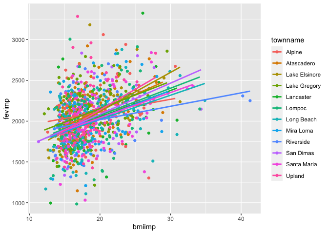
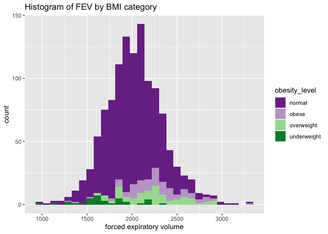
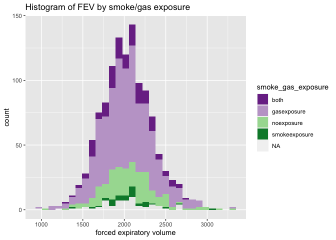
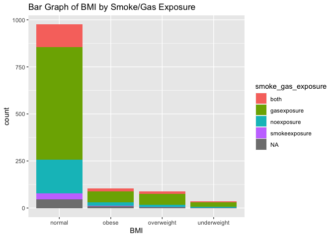
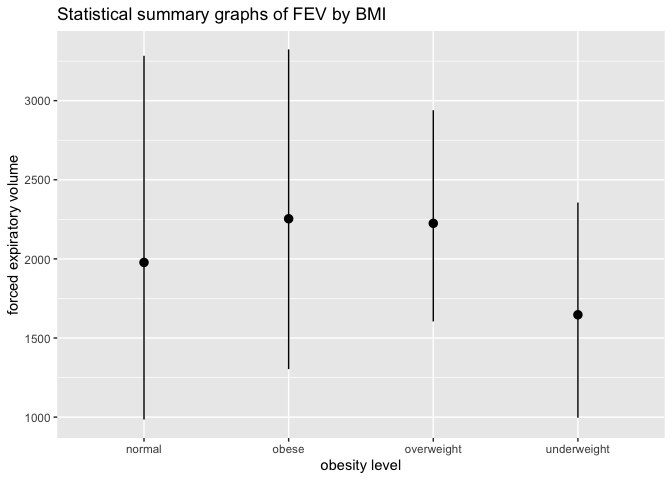
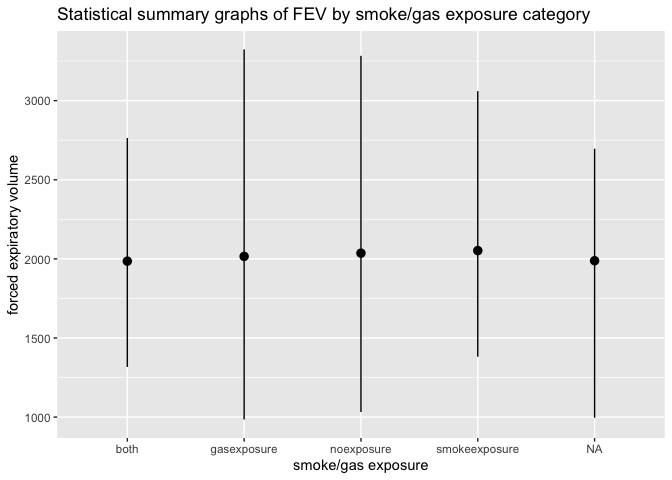

HMWK2
================
Jiawen
2022-10-06

``` r
library(tidyverse)
```

    ## ── Attaching packages ─────────────────────────────────────── tidyverse 1.3.2 ──
    ## ✔ ggplot2 3.3.6      ✔ purrr   0.3.4 
    ## ✔ tibble  3.1.8      ✔ dplyr   1.0.10
    ## ✔ tidyr   1.2.0      ✔ stringr 1.4.0 
    ## ✔ readr   2.1.2      ✔ forcats 0.5.2 
    ## ── Conflicts ────────────────────────────────────────── tidyverse_conflicts() ──
    ## ✖ dplyr::filter() masks stats::filter()
    ## ✖ dplyr::lag()    masks stats::lag()

``` r
library(readr)
library(readxl)
library(lubridate)
```

    ## 
    ## Attaching package: 'lubridate'
    ## 
    ## The following objects are masked from 'package:base':
    ## 
    ##     date, intersect, setdiff, union

``` r
library(psych)
```

    ## 
    ## Attaching package: 'psych'
    ## 
    ## The following objects are masked from 'package:ggplot2':
    ## 
    ##     %+%, alpha

``` r
library(ggplot2)
library(data.table)
```

    ## 
    ## Attaching package: 'data.table'
    ## 
    ## The following objects are masked from 'package:lubridate':
    ## 
    ##     hour, isoweek, mday, minute, month, quarter, second, wday, week,
    ##     yday, year
    ## 
    ## The following objects are masked from 'package:dplyr':
    ## 
    ##     between, first, last
    ## 
    ## The following object is masked from 'package:purrr':
    ## 
    ##     transpose

``` r
library(dplyr)
library(leaflet)
```

``` r
chsindividual <- fread ("chs_individual.csv")
chsregional   <- fread ("chs_regional.csv")
```

``` r
#merge two datasets using the location variable
chsmerged <-
  chsindividual %>%
  full_join(chsregional, by="townname")
```

\#1.After merging the data, make sure you don’t have any duplicates by
counting the number of rows. Make sure it matches. have question here

``` r
dim(chsmerged)
```

    ## [1] 1200   47

``` r
dim(chsindividual)
```

    ## [1] 1200   23

The two datasets have same number of rows which is 12, so it seems that
there is no duplicates

\#In the case of missing values, impute data using the average within
the variables “male” and “hispanic.”

``` r
# mutate male and hispanic, then calculate the mean of new value? BMI FEV--lecture 5
which(is.na(chsindividual$male))
```

    ## integer(0)

``` r
which(is.na(chsindividual$hispanic))
```

    ## integer(0)

``` r
chsmerged [, bmiimp := fcoalesce(bmi, mean(bmi, na.rm = TRUE)),
by = .(male,hispanic)]
```

    ## Warning in `[.data.table`(chsmerged, , `:=`(bmiimp, fcoalesce(bmi, mean(bmi, :
    ## Invalid .internal.selfref detected and fixed by taking a (shallow) copy of the
    ## data.table so that := can add this new column by reference. At an earlier point,
    ## this data.table has been copied by R (or was created manually using structure()
    ## or similar). Avoid names<- and attr<- which in R currently (and oddly) may
    ## copy the whole data.table. Use set* syntax instead to avoid copying: ?set, ?
    ## setnames and ?setattr. If this message doesn't help, please report your use case
    ## to the data.table issue tracker so the root cause can be fixed or this message
    ## improved.

``` r
chsmerged [, fevimp := fcoalesce(fev, mean(fev, na.rm = TRUE)),
by = .(male,hispanic)]

  #dat[, temp_imp := fcoalesce(temp, mean(temp, na.rm = TRUE)),
    #by = .(STATE, year, month, day)]
```

it shows there is no missing value in case of Male and hispanic, we
input the missing values of FEV, BMI by male and hispanic

\#2.1 create a new categorical variable named “obesity_level” using the
BMI measurement (underweight BMI\<14; normal BMI 14-22; overweight BMI
22-24; obese BMI\>24)

``` r
    chsmerged[, obesity_level := fifelse(bmiimp<14, "underweight", 
    fifelse(bmiimp<22, "normal",
    fifelse(bmiimp<=24, "overweight", "obese")))]
```

\#2.2 To make sure the variable is rightly coded, create a summary table
that contains the minimum BMI, maximum BMI, and the total number of
observations per category.

``` r
   chsmerged[, .(
  N          = .N,
  minbmi     = min(bmiimp),
  maxbmi     = max(bmiimp)
  ), by = obesity_level][order(obesity_level)]
```

    ##    obesity_level   N   minbmi   maxbmi
    ## 1:        normal 975 14.00380 21.96387
    ## 2:         obese 103 24.00647 41.26613
    ## 3:    overweight  87 22.02353 23.99650
    ## 4:   underweight  35 11.29640 13.98601

\#3. Create another categorical variable named “smoke_gas_exposure” that
summarizes “Second Hand Smoke” and “Gas Stove.” The variable should have
four categories in total.

``` r
    chsmerged [, smoke_gas_exposure := fifelse(
    smoke == 0 & gasstove == 0, "noexposure",
    fifelse(smoke == 1 & gasstove == 0, "smokeexposure",
    fifelse(smoke == 0 & gasstove == 1, "gasexposure","both")))]
```

\#4. Create four summary tables showing the average (or proportion, if
binary) and sd of “Forced expiratory volume in 1 second (ml)” and asthma
indicator by town, sex, obesity level, and “smoke_gas_exposure.”

``` r
##by town
chsmerged %>%
  group_by(townname) %>%
  summarise(
    avgfev = mean(fevimp, na.rm=T),
    sdfev = sd(fevimp, na.rm=T),
    propasthma = mean(asthma, na.rm=T)
  ) %>%
  knitr::kable()
```

| townname      |   avgfev |    sdfev | propasthma |
|:--------------|---------:|---------:|-----------:|
| Alpine        | 2087.101 | 291.1768 |  0.1134021 |
| Atascadero    | 2075.897 | 324.0935 |  0.2551020 |
| Lake Elsinore | 2038.849 | 303.6956 |  0.1263158 |
| Lake Gregory  | 2084.700 | 319.9593 |  0.1515152 |
| Lancaster     | 2003.044 | 317.1298 |  0.1649485 |
| Lompoc        | 2034.354 | 351.0454 |  0.1134021 |
| Long Beach    | 1985.861 | 319.4625 |  0.1354167 |
| Mira Loma     | 1985.202 | 324.9634 |  0.1578947 |
| Riverside     | 1989.881 | 277.5065 |  0.1100000 |
| San Dimas     | 2026.794 | 318.7845 |  0.1717172 |
| Santa Maria   | 2025.750 | 312.1725 |  0.1340206 |
| Upland        | 2024.266 | 343.1637 |  0.1212121 |

``` r
##by sex
chsmerged %>%
  group_by(male) %>%
  summarise(
    avgfev = mean(fevimp, na.rm=T),
    sdfev = sd(fevimp, na.rm=T),
    propasthma = mean(asthma, na.rm=T)
  ) %>%
  knitr::kable()
```

| male |   avgfev |    sdfev | propasthma |
|-----:|---------:|---------:|-----------:|
|    0 | 1958.911 | 311.9181 |  0.1208054 |
|    1 | 2103.787 | 307.5123 |  0.1727749 |

``` r
##by obesity level
chsmerged %>%
  group_by(obesity_level) %>%
  summarise(
    avgfev = mean(fevimp, na.rm=T),
    sdfev = sd(fevimp, na.rm=T),
    propasthma = mean(asthma, na.rm=T)
  ) %>%
  knitr::kable()
```

| obesity_level |   avgfev |    sdfev | propasthma |
|:--------------|---------:|---------:|-----------:|
| normal        | 1999.794 | 295.1964 |  0.1401475 |
| obese         | 2266.154 | 325.4710 |  0.2100000 |
| overweight    | 2224.322 | 317.4261 |  0.1647059 |
| underweight   | 1698.327 | 303.3983 |  0.0857143 |

``` r
##by smoke_gas_exposure
chsmerged %>%
  group_by(smoke_gas_exposure) %>%
  summarise(
    avgfev = mean(fevimp, na.rm=T),
    sdfev = sd(fevimp, na.rm=T),
    propasthma = mean(asthma, na.rm=T)
  ) %>%
  knitr::kable()
```

| smoke_gas_exposure |   avgfev |    sdfev | propasthma |
|:-------------------|---------:|---------:|-----------:|
| both               | 2019.867 | 298.9728 |  0.1301370 |
| gasexposure        | 2025.989 | 317.6305 |  0.1477428 |
| noexposure         | 2055.356 | 330.4169 |  0.1476190 |
| smokeexposure      | 2055.714 | 295.6475 |  0.1714286 |
| NA                 | 2001.878 | 340.2592 |  0.1489362 |

\#EDA 1.Facet plot showing scatterplots with regression lines of BMI vs
FEV by “townname”. \#1. What is the association between BMI and FEV
(forced expiratory volume)? \#2. What is the association between smoke
and gas exposure and FEV? \#3. What is the association between PM2.5
exposure and FEV?

``` r
  chsmerged %>%
  ggplot(aes(x = bmiimp, y = fevimp, color=townname, line=townname)) +
  geom_point() +
  geom_smooth(se = F, method = "lm")
```

    ## `geom_smooth()` using formula 'y ~ x'

<!-- -->

``` r
  lm(fevimp ~ bmiimp, data = chsmerged)
```

    ## 
    ## Call:
    ## lm(formula = fevimp ~ bmiimp, data = chsmerged)
    ## 
    ## Coefficients:
    ## (Intercept)       bmiimp  
    ##     1452.46        31.22

bmi and fev are positively related

\#EDA 2.Stacked histograms of FEV by BMI category and FEV by smoke/gas
exposure. Use different color schemes than the ggplot default.

``` r
chsmerged %>%
  ggplot(aes(x=fevimp,fill=obesity_level))+
  geom_histogram(aes(x=fevimp,fill=obesity_level))+
  scale_fill_brewer(palette='PRGn')+
  labs(title = "Histogram of FEV by BMI category", x="forced expiratory volume")
```

    ## `stat_bin()` using `bins = 30`. Pick better value with `binwidth`.

<!-- -->

``` r
chsmerged %>%
  ggplot(aes(x=fevimp,fill=smoke_gas_exposure))+
  geom_histogram(aes(x=fevimp,fill=smoke_gas_exposure))+
  scale_fill_brewer(palette='PRGn')+
  labs(title = "Histogram of FEV by smoke/gas exposure", x="forced expiratory volume")
```

    ## `stat_bin()` using `bins = 30`. Pick better value with `binwidth`.

<!-- -->

The amount of People whose BMI is “normal” is greater than other
categories, and from this graph we can say its relationship with FEV it
is basically near to normally distribution

The amount of people who expose to gas is significantly higher than
other gas or smoke exposure categories, and from this graph we can say
its relationship with FEV it is basically near to normally distribution

\#EDA 3. Barchart of BMI by smoke/gas exposure.

``` r
chsmerged %>%
  ggplot(mapping = aes(x = obesity_level, fill = smoke_gas_exposure))+
  geom_bar() +
    labs(title = "Bar Graph of BMI by Smoke/Gas Exposure", x = "BMI")  
```

<!-- --> No matter
what type of BMI that people belong to, most of them are proposed to
gas. \#EDA 4. Statistical summary graphs of FEV by BMI and FEV by
smoke/gas exposure category.

``` r
chsmerged %>%
  ggplot() + 
    stat_summary(mapping = aes(x = obesity_level, y = fevimp),
    fun.min = min,
    fun.max = max,
    fun = median)+
    labs(title = "Statistical summary graphs of FEV by BMI", x = "obesity level", y = "forced expiratory volume")
```

<!-- --> The mean of
FEV in different obesity level vary significantly. People who are obese
tend to have higher FEV value

``` r
chsmerged %>%
  ggplot() + 
    stat_summary(mapping = aes(x = smoke_gas_exposure, y = fevimp),
    fun.min = min,
    fun.max = max,
    fun = median)+
    labs(title = "Statistical summary graphs of FEV by smoke/gas exposure category", x = "smoke/gas exposure", y = "forced expiratory volume")
```

<!-- --> the mean of
FEV in different smoke/gas exposure groups are approximate

\#EDA 5. A leaflet map showing the concentrations of PM2.5 mass in each
of the CHS communities.

``` r
# Generating a color palette
#pm25.pal <- colorNumeric(c('darkgreen','goldenrod','brown'), domain=chsmerged$pm25_mass)
#chsmap <- leaflet(chsmerged) %>%
  #addProviderTiles('CartoDB.Positron') %>% 
  #addCircles(lat=~lat, lng=~lon,
     #label = ~`pm25_mass`, color = ~ pm25.pal(pm25_mass),
     #opacity = 1, fillOpacity = 1, radius = 60
    #) %>%
  # And a pretty legend
  #addLegend('bottomleft', pal=pm25.pal, values=chsmerged$pm25_mass,
          #title='PM2.5 mass', opacity=1)
```

shows error but do not know the reason why \#EDA 6. Choose a
visualization to examine whether PM2.5 mass is associated with FEV.
