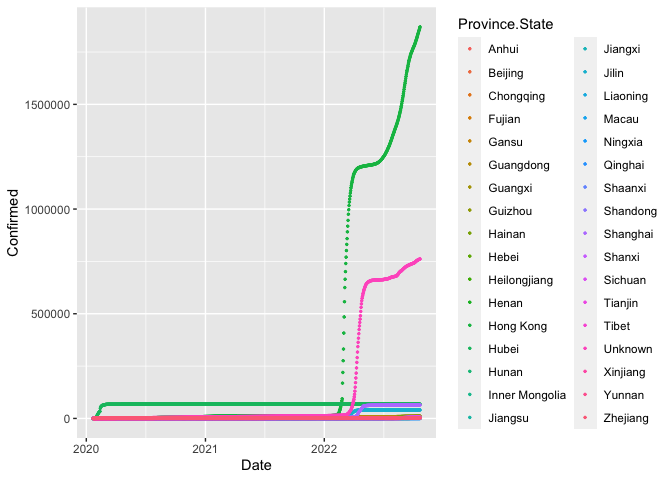
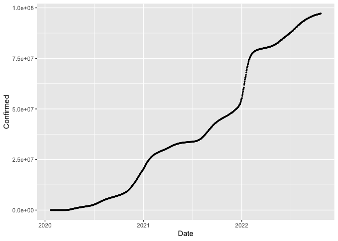
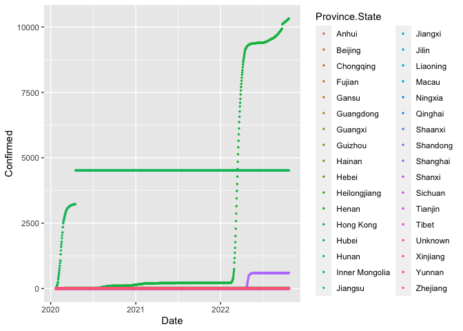
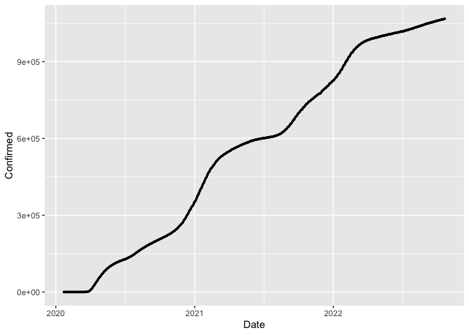
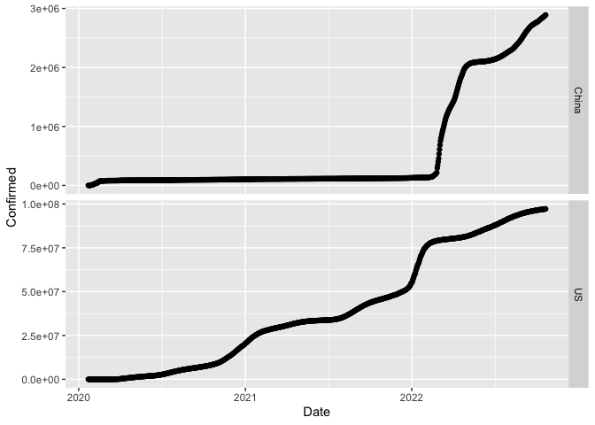
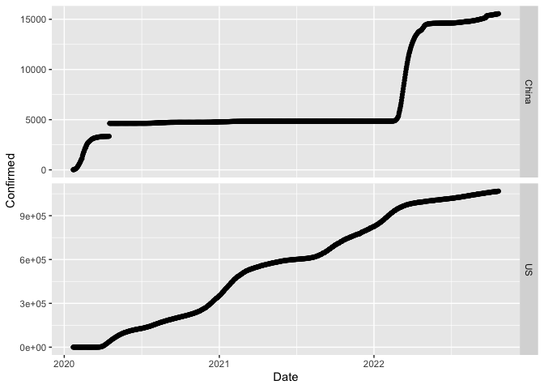

Midterm
================
Jiawen
2022-10-22

``` r
library(readr)
library(readxl)
library(lubridate)
```

    ## 
    ## Attaching package: 'lubridate'

    ## The following objects are masked from 'package:base':
    ## 
    ##     date, intersect, setdiff, union

``` r
library(psych)
library(ggplot2)
```

    ## 
    ## Attaching package: 'ggplot2'

    ## The following objects are masked from 'package:psych':
    ## 
    ##     %+%, alpha

``` r
library(data.table)
```

    ## 
    ## Attaching package: 'data.table'

    ## The following objects are masked from 'package:lubridate':
    ## 
    ##     hour, isoweek, mday, minute, month, quarter, second, wday, week,
    ##     yday, year

``` r
library(dplyr)
```

    ## 
    ## Attaching package: 'dplyr'

    ## The following objects are masked from 'package:data.table':
    ## 
    ##     between, first, last

    ## The following objects are masked from 'package:stats':
    ## 
    ##     filter, lag

    ## The following objects are masked from 'package:base':
    ## 
    ##     intersect, setdiff, setequal, union

``` r
library(leaflet)
library(tidyr)
library(tidyselect)
install.packages("ggformula")
```

    ## Installing package into '/Users/chenjiawen/Library/R/arm64/4.2/library'
    ## (as 'lib' is unspecified)

``` r
install.packages("ggstance")
```

    ## Installing package into '/Users/chenjiawen/Library/R/arm64/4.2/library'
    ## (as 'lib' is unspecified)

``` r
library(ggformula)
```

    ## Loading required package: ggstance

    ## 
    ## Attaching package: 'ggstance'

    ## The following objects are masked from 'package:ggplot2':
    ## 
    ##     geom_errorbarh, GeomErrorbarh

    ## Loading required package: scales

    ## 
    ## Attaching package: 'scales'

    ## The following objects are masked from 'package:psych':
    ## 
    ##     alpha, rescale

    ## The following object is masked from 'package:readr':
    ## 
    ##     col_factor

    ## Loading required package: ggridges

    ## 
    ## New to ggformula?  Try the tutorials: 
    ##  learnr::run_tutorial("introduction", package = "ggformula")
    ##  learnr::run_tutorial("refining", package = "ggformula")

``` r
library(ggstance)
library(tidyverse)
```

    ## ── Attaching packages
    ## ───────────────────────────────────────
    ## tidyverse 1.3.2 ──

    ## ✔ tibble  3.1.8     ✔ stringr 1.4.0
    ## ✔ purrr   0.3.4     ✔ forcats 0.5.2
    ## ── Conflicts ────────────────────────────────────────── tidyverse_conflicts() ──
    ## ✖ ggplot2::%+%()             masks psych::%+%()
    ## ✖ scales::alpha()            masks ggplot2::alpha(), psych::alpha()
    ## ✖ lubridate::as.difftime()   masks base::as.difftime()
    ## ✖ dplyr::between()           masks data.table::between()
    ## ✖ scales::col_factor()       masks readr::col_factor()
    ## ✖ lubridate::date()          masks base::date()
    ## ✖ purrr::discard()           masks scales::discard()
    ## ✖ dplyr::filter()            masks stats::filter()
    ## ✖ dplyr::first()             masks data.table::first()
    ## ✖ ggstance::geom_errorbarh() masks ggplot2::geom_errorbarh()
    ## ✖ data.table::hour()         masks lubridate::hour()
    ## ✖ lubridate::intersect()     masks base::intersect()
    ## ✖ data.table::isoweek()      masks lubridate::isoweek()
    ## ✖ dplyr::lag()               masks stats::lag()
    ## ✖ dplyr::last()              masks data.table::last()
    ## ✖ data.table::mday()         masks lubridate::mday()
    ## ✖ data.table::minute()       masks lubridate::minute()
    ## ✖ data.table::month()        masks lubridate::month()
    ## ✖ data.table::quarter()      masks lubridate::quarter()
    ## ✖ data.table::second()       masks lubridate::second()
    ## ✖ lubridate::setdiff()       masks base::setdiff()
    ## ✖ purrr::transpose()         masks data.table::transpose()
    ## ✖ lubridate::union()         masks base::union()
    ## ✖ data.table::wday()         masks lubridate::wday()
    ## ✖ data.table::week()         masks lubridate::week()
    ## ✖ data.table::yday()         masks lubridate::yday()
    ## ✖ data.table::year()         masks lubridate::year()

\#1. Introduction: I got this dataset from
“<https://data.humdata.org/dataset/novel-coronavirus-2019-ncov-cases>?”.
These two datasets are about the accumulated-confirmed and death cases
of different countries around the world throughout the whole pandemic
(1/22/20-10/13/22).Questions: the main goal is to compare and visualize
China and the US data. Frist, we need to download them and converted the
empty columns to NA

``` r
download.file("https://data.humdata.org/hxlproxy/api/data-preview.csv?url=https%3A%2F%2Fraw.githubusercontent.com%2FCSSEGISandData%2FCOVID-19%2Fmaster%2Fcsse_covid_19_data%2Fcsse_covid_19_time_series%2Ftime_series_covid19_confirmed_global.csv&filename=time_series_covid19_confirmed_global.csv", "time_series_covid19_confirmed_global.csv", method="libcurl", timeout = 60)
confirmed <- read.csv("time_series_covid19_confirmed_global.csv", header = TRUE, na.strings = c("", " "))
 
download.file("https://data.humdata.org/hxlproxy/api/data-preview.csv?url=https%3A%2F%2Fraw.githubusercontent.com%2FCSSEGISandData%2FCOVID-19%2Fmaster%2Fcsse_covid_19_data%2Fcsse_covid_19_time_series%2Ftime_series_covid19_deaths_global.csv&filename=time_series_covid19_deaths_global.csv", "time_series_covid19_deaths_global.csv", methos="libcurl", timeout = 60)
deaths <- read.csv("time_series_covid19_deaths_global.csv", header = TRUE, na.strings = c("", " "))
```

\#We have variales called “province” ““Country/Region”, “Lat”, “Long”
and different dates

\#2. Transform the confirmed and deaths data of these two countries into
dataframes

``` r
chinaconfirmed <-
  confirmed %>%
  filter(Country.Region == "China")

usconfirmed <-
  confirmed %>%
  filter(Country.Region == "US")

chinadeaths <-
  deaths %>%
  filter(Country.Region == "China")

usdeaths <-
  deaths %>%
  filter(Country.Region == "US")
```

\#3. those dataframes are represented as a single row with the date
values as columns. This format is not ideal and cannot be graphed or
used in model creation, Now lets reshape the data frames, transform date
into normal numerical form

``` r
chinaconfirmed %>%
   pivot_longer(cols= -one_of('Country.Region','Province.State','Lat','Long')
               ,names_to = 'Date'
               ,values_to = 'Confirmed') ->
  chinaconfirmed
    # remove the X infront of date and convert date to normal date datatype
    chinaconfirmed$Date <- sapply(chinaconfirmed$Date,function(x) {x <- gsub("X","",x)})
    chinaconfirmed$Date <- as.Date(chinaconfirmed$Date, "%m.%d.%y")
    
usconfirmed %>%
   pivot_longer(cols= -one_of('Country.Region','Province.State','Lat','Long')
               ,names_to = 'Date'
               ,values_to = 'Confirmed') ->
  usconfirmed
    usconfirmed$Date <- sapply(usconfirmed$Date,function(x) {x <- gsub("X","",x)})
    usconfirmed$Date <- as.Date(usconfirmed$Date, "%m.%d.%y")
    
chinadeaths %>%
   pivot_longer(cols= -one_of('Country.Region','Province.State','Lat','Long')
               ,names_to = 'Date'
               ,values_to = 'Confirmed') ->
  chinadeaths
    chinadeaths$Date <- sapply(chinadeaths$Date,function(x) {x <- gsub("X","",x)})
    chinadeaths$Date <- as.Date(chinadeaths$Date, "%m.%d.%y")    
    
usdeaths %>%
   pivot_longer(cols= -one_of('Country.Region','Province.State','Lat','Long')
               ,names_to = 'Date'
               ,values_to = 'Confirmed') ->
  usdeaths
    usdeaths$Date <- sapply(usconfirmed$Date,function(x) {x <- gsub("X","",x)})
    usdeaths$Date <- as.Date(usconfirmed$Date, "%m.%d.%y")    
```

\#graphs of china and US confirmed and deaths cases

``` r
chinaconfirmed %>%
  group_by(Date) %>%
  ggplot(aes(x = Date, y = Confirmed, color=Province.State, line=Province.State)) +
  geom_point(size=0.5, alpha=1) 
```

<!-- -->

``` r
usconfirmed %>%
  group_by(Date) %>%
  ggplot(aes(x = Date, y = Confirmed)) +
  geom_point(size=0.5, alpha=1) 
```

<!-- -->

``` r
chinadeaths %>%
  group_by(Date) %>%
  ggplot(aes(x = Date, y = Confirmed, color=Province.State, line=Province.State)) +
  geom_point(size=0.5, alpha=1) 
```

<!-- -->

``` r
usdeaths %>%
  group_by(Date) %>%
  ggplot(aes(x = Date, y = Confirmed)) +
  geom_point(size=0.5, alpha=1) 
```

<!-- -->

\#let’s make those two contries in comparision

``` r
   confirmed %>%
   pivot_longer(cols= -one_of('Country.Region','Province.State','Lat','Long')
               ,names_to = 'Date'
               ,values_to = 'Confirmed') ->
    confirmed
    confirmed$Date <- sapply(confirmed$Date,function(x) {x <- gsub("X","",x)})
    confirmed$Date <- as.Date(confirmed$Date, "%m.%d.%y")

  confirmed %>%
  filter(Country.Region %in% c("US", "China")) %>%
  group_by(Country.Region, Date) %>% 
  summarise(Confirmed = sum(Confirmed)) %>% 
  gf_point(Confirmed ~ Date) %>%
  gf_facet_grid(Country.Region ~ ., scales = "free")
```

    ## `summarise()` has grouped output by 'Country.Region'. You can override using
    ## the `.groups` argument.

<!-- -->

``` r
  #deaths case
  deaths %>%
   pivot_longer(cols= -one_of('Country.Region','Province.State','Lat','Long')
               ,names_to = 'Date'
               ,values_to = 'Confirmed') ->
    deaths
    deaths$Date <- sapply(confirmed$Date,function(x) {x <- gsub("X","",x)})
    deaths$Date <- as.Date(confirmed$Date, "%m.%d.%y")
    
  deaths %>%
  filter(Country.Region %in% c("US", "China")) %>%
  group_by(Country.Region, Date) %>% 
  summarise(Confirmed = sum(Confirmed)) %>% 
  gf_point(Confirmed ~ Date) %>%
  gf_facet_grid(Country.Region ~ ., scales = "free")
```

    ## `summarise()` has grouped output by 'Country.Region'. You can override using
    ## the `.groups` argument.

<!-- --> \#We can
conclude from those graphs, China started confirming cases ealier than
the US but the confirmed and deaths cases increased slightly until the
beginning of 2022. However, the overall deaths and confirmed cases in
the US are significantly higher than China.
